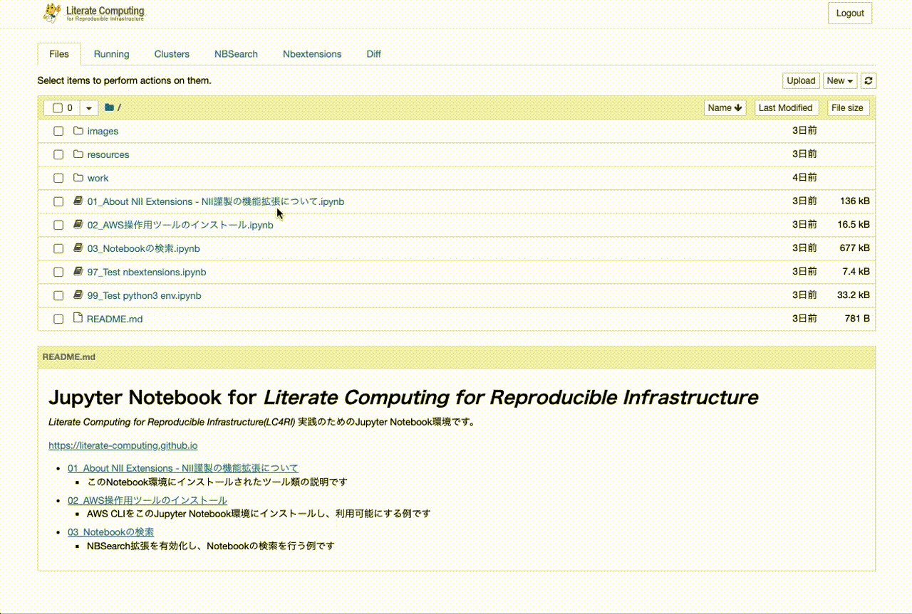

# nbsearch

[](https://github.com/NII-cloud-operation/nbsearch/actions/workflows/release.yml) [](https://mybinder.org/v2/gh/NII-cloud-operation/nbsearch/feature/lab?urlpath=lab)

nbsearch extension provides search capabilities for Jupyter Notebooks, which you created. It supports search by MEME in addition to search by keywords and modified times like a search engine.

## Try it out on mybinder.org

You can try out the extension on mybinder.org by clicking the Binder badge above, and refer to the [Usage](#usage) section for more information.

The following software is installed in this environment.

- Services
  - JupyterLab
  - Jupyter Notebook 7
  - [Apache Solr](https://solr.apache.org/)
  - [MinIO](https://min.io/)

- Extensions
  - nbsearch
  - [nblineage](https://github.com/NII-cloud-operation/Jupyter-LC_nblineage)
  - [lc_notebook_diff](https://github.com/NII-cloud-operation/Jupyter-LC_notebook_diff)

If you create a Notebook file in this environment, it will be automatically indexed in Solr and you will be able to search for it. Please refer to the [Usage](#usage) section for more information.

> **Note**: It may take some time for Apache Solr and MinIO to start up. If your search fails, please wait a while and try again.

## Requirements

- JupyterLab >= 4.0.0
- Jupyter Notebook >= 7.0.0

## Install

To install the extension, execute:

```bash
pip install git+https://github.com/NII-cloud-operation/nbsearch
```

To use nbsearch extension, you will also need to install and enable. You can use Jupyter subcommand:

```
jupyter server extension enable nbsearch
jupyter labextension enable nbsearch

# If you want to use the extension with the classic notebook,
# you need to install and enable the nbclassic notebook extension.
jupyter nbclassic-extension install --py --sys-prefix nbsearch
jupyter nbclassic-serverextension enable --py --sys-prefix nbsearch
jupyter nbclassic-extension enable --py --sys-prefix nbsearch
```

To compare multiple Notebooks, you need to install [Jupyter-LC_notebook_diff](https://github.com/NII-cloud-operation/Jupyter-LC_notebook_diff), as shown below.

```
pip install git+https://github.com/NII-cloud-operation/Jupyter-LC_notebook_diff.git@feature/lab
jupyter labextension enable lc_notebook_diff

# If you want to use the extension with the classic notebook,
# you need to install and enable the nbclassic notebook extension.
jupyter nbclassic-extension enable --py --sys-prefix lc_notebook_diff
```

then restart Jupyter notebook.

## Settings

In order to use nbsearch, [Solr](https://solr.apache.org/) and S3 compatible storage is required.
Solr is used as a search index and S3 compatible storage is used to store the Notebook data.

You must prepare a Solr server and a S3 compatible storage that can be connected from your Jupyter Notebook,
and describe the configuration in your jupyter_notebook_config.

### Setting up Solr

You need to install Solr and configure two cores with the following schemas.

1. [jupyter-notebook core](./solr/jupyter-notebook/)
1. [jupyter-cell core](./solr/jupyter-cell/)

### Prepare S3 compatible storage

You can use AWS S3 or [MinIO](https://min.io/) as your S3 compatible storage. Install if needed.

### Configuring Jupyter Notebook

You need to describe the following settings in `jupyter_notebook_config`.

```
c.NBSearchDB.solr_base_url = 'http://localhost:8983'
c.NBSearchDB.s3_endpoint_url = 'http://localhost:9000'
c.NBSearchDB.solr_basic_auth_username = 'USERNAME_FOR_SOLR'
c.NBSearchDB.solr_basic_auth_password = 'PASSWORD_FOR_SOLR'
c.NBSearchDB.s3_access_key = 'ACCESS_KEY_FOR_S3'
c.NBSearchDB.s3_secret_key = 'SECRET_KEY_FOR_S3'

c.LocalSource.base_dir = '/home/jovyan'
c.LocalSource.server = 'http://localhost:8888/'
```

* `c.NBSearchDB.solr_base_url` - The base URL of Solr(default: `http://localhost:8983`)
* `c.NBSearchDB.solr_basic_auth_username`, `c.NBSearchDB.solr_basic_auth_password` - The username and password for Solr(if needed)
* `c.NBSearchDB.s3_endpoint_url` - The URL of S3(default: http://localhost:9000)
* `c.NBSearchDB.s3_access_key`, `c.NBSearchDB.s3_secret_key` - The access key and secret key for S3(required)
* `c.NBSearchDB.s3_region_name` - The region name of S3(if needed)
* `c.NBSearchDB.s3_bucket_name` - The bucket on S3(required)
* `c.NBSearchDB.solr_notebook` - The core for notebooks on Solr(default: `jupyter-notebook`)
* `c.NBSearchDB.solr_cell` - The core for cells on Solr(default: `jupyter-cell`)
* `c.LocalSource.base_dir` - Notebook directory to be searchable
* `c.LocalSource.server` - URL of my server, used to identify the notebooks on this server(default: http://localhost:8888/)

### Additional Settings for Magic Commands

To enable the nbsearch magic commands functionality, add the following configuration:

```
# Enable the JupyterLab extension for nbsearch magic commands
c.JupyterNotebookApp.expose_app_in_browser = True
c.LabApp.expose_app_in_browser = True
```

* `c.JupyterNotebookApp.expose_app_in_browser` - Enables browser exposure for Jupyter Notebook app (required for magic commands)
* `c.LabApp.expose_app_in_browser` - Enables browser exposure for JupyterLab app (required for magic commands)

## Usage

### Add indexes of notebooks to Solr

To make all your current notebooks searchable, run the following command. When you run this command, a collection for retrieval is prepared on the Solr.

```
jupyter nbsearch update-index $CONDA_DIR/etc/jupyter/jupyter_notebook_config.py --debug local
```

### Search for Notebooks

You can use the NBSearch tab to search for notebooks. By clicking on the search result, you can check the contents of the notebook.



### Quick Search from Markdown Cells

In Markdown cells, search icons (🔍) appear next to headings and hashtags. Clicking these icons instantly searches for notebooks containing the same heading or hashtag.


### Search for Cells

To search for cells and insert them into your notebook, use the `%%nbsearch` magic command. The magic command allows you to search for cells using keywords or MEME, select specific sections, and insert them directly into your notebook.

First, load the nbsearch magic extension:
```python
%load_ext nbsearch.magics
```

Then you can use the magic command:


#### Simple String Query

```
%%nbsearch
ansible hadoop
```

This executes a full-text search for "ansible hadoop" and opens an interactive search interface where you can browse results and select sections to insert.

#### YAML Query with Multiple Criteria

```
%%nbsearch
query:
  composition: AND
  keyword:
    source: "operationhub"
    outputs: "success"
```

This searches for cells that contain both "operationhub" in the source and "success" in the outputs.

#### Automatic Updates After Cell Insertion

When you select and insert sections from search results, the magic command automatically updates to include the search metadata:

```
# %%nbsearch
# query:
#   composition: AND
#   keyword:
#     source: matplotlib
# scope: section
# range: after
# memeFilter:
#   previous: true
#   next: false
#   exactMatch: false
```

The commented-out lines preserve your search criteria and insertion settings (scope, range, MEME filter). You can uncomment and re-execute to repeat the same search or modify the criteria for new searches. When re-executing, if cells with the same MEME sequence already exist after the current cell, the system will update their content and metadata instead of inserting duplicate cells.

## Uninstall

To remove the extension, execute:

```bash
pip uninstall nbsearch
```

## Contributing

### Development install

Note: You will need NodeJS to build the extension package.

The `jlpm` command is JupyterLab's pinned version of
[yarn](https://yarnpkg.com/) that is installed with JupyterLab. You may use
`yarn` or `npm` in lieu of `jlpm` below.

#### Local Development with Docker Compose

For local development, you can use Docker Compose to run Solr and MinIO:

```bash
# Clone the repo to your local environment
# Change directory to the nbsearch directory
# Start Solr and MinIO
docker compose up -d

# Install package in development mode
pip install -e "."
# Link your development version of the extension with JupyterLab
jupyter labextension develop . --overwrite
jupyter server extension enable nbsearch
# Rebuild extension Typescript source after making changes
jlpm build
```

You can watch the source directory and run JupyterLab at the same time in different terminals to watch for changes in the extension's source and automatically rebuild the extension.

```bash
# Watch the source directory in one terminal, automatically rebuilding when needed
jlpm watch
# Run JupyterLab in another terminal
jupyter lab --config=example/config_docker_compose.py
```

When using Docker Compose, Solr indexes are not automatically updated. You need to manually update the index:

```bash
# Update index for specific notebooks
jupyter nbsearch update-index example/config_docker_compose.py local ./example/notebooks/01_About\ NII\ Extensions\ -\ NII謹製の機能拡張について.ipynb

# Or update all notebooks in a directory
jupyter nbsearch update-index example/config_docker_compose.py local
```

To stop Solr and MinIO:

```bash
docker compose down
```

#### Install without Docker Compose

If you want to set up Solr and MinIO manually:

```bash
# Clone the repo to your local environment
# Change directory to the nbsearch directory
# Install package in development mode
pip install -e "."
# Link your development version of the extension with JupyterLab
jupyter labextension develop . --overwrite
jupyter server extension enable nbsearch
# Rebuild extension Typescript source after making changes
jlpm build
```

With the watch command running, every saved change will immediately be built locally and available in your running JupyterLab. Refresh JupyterLab to load the change in your browser (you may need to wait several seconds for the extension to be rebuilt).

By default, the `jlpm build` command generates the source maps for this extension to make it easier to debug using the browser dev tools. To also generate source maps for the JupyterLab core extensions, you can run the following command:

```bash
jupyter lab build --minimize=False
```

### Development uninstall

```bash
pip uninstall nbsearch
```

In development mode, you will also need to remove the symlink created by `jupyter labextension develop`
command. To find its location, you can run `jupyter labextension list` to figure out where the `labextensions`
folder is located. Then you can remove the symlink named `nbsearch` within that folder.

### Testing the extension

#### Frontend tests

This extension is using [Jest](https://jestjs.io/) for JavaScript code testing.

To execute them, execute:

```sh
jlpm
jlpm test
```

#### Integration tests

This extension uses [Playwright](https://playwright.dev/docs/intro) for the integration tests (aka user level tests).
More precisely, the JupyterLab helper [Galata](https://github.com/jupyterlab/jupyterlab/tree/master/galata) is used to handle testing the extension in JupyterLab.

More information are provided within the [ui-tests](./ui-tests/README.md) README.

### Packaging the extension

See [RELEASE](RELEASE.md)
